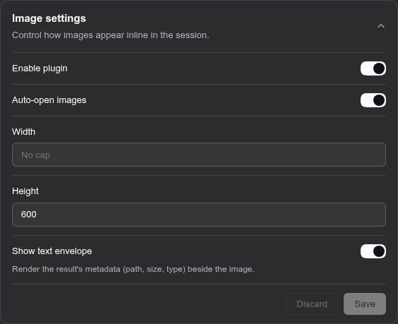

[](https://www.npmjs.com/package/dsh-image-settings)
[](./LICENSE)

#  dsh-image-settings

[English](README.md) | 中文

在 dsh web 会话中内联显示 `read_image` 的结果 — 按该行的可用宽度显示、默认自动展开 — 显示方式可通过「图像设置」卡片实时调整。

## 安装

```
dsh plugin --profile web add dsh-image-settings
```

（首次安装后重启一次 `dsh web`）

## 配置



卡片中的字段与 `settings.yaml` 的 `image-settings:` 节一一对应。

## 变更记录

按版本粗略记录：[CHANGELOG.md](CHANGELOG.md) · [Releases](https://github.com/americanjeff/dsh-image-settings/releases)。

## 许可证

MIT。见 [LICENSE](./LICENSE)。
